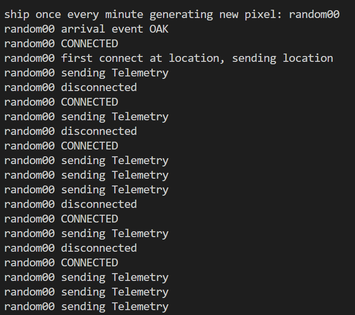

# Wiliot Hackathon

William Wood Harter Wiliot hackathon entry. February 2023

I started by building a home and specifically a fridge monitor.

The start of the app was to receive messages from the Pixels using MQTT. This app is called watcher.py. The next step was a Flask app/web service to receive the messages from watcher and save them to a database. The thirdstep was a React user interface to show the Pixel data from the pixels around the house. I need more control over the process so I wrote a third application that would send temperature messages to the MQTT server. This made it much easier to debug the process rather than dealing with power sources physical Pixels.

The initial plan was to send notifications to Alexa if the temperature rose or dropped below a specific value. Getting the live Pixel data from around the house seemed difficult given the need for proximity of power so I decided to consider a more traditional application of pixels moving across a geography. I greatly enhanced the Pixel simulator to generate new Pixels and have them move across a virtual geography.  That simulation is fully configurable, but the default has four cities, Oakland, Los Angeles, Orange County and Phoenix.  A generator creates a new pixel on a random timer and sends them from Oakland to Phoenix.

[Here is a recorded demo](https://1drv.ms/v/s!AtCZrBKyeDC_mLkfboP8bkl7HEGhzA?e=6G1pwi)

# Pixel Simulator

This can simulate Pixels moving across a definable geography. This is a screenshot of output from the pixel simulator creating new pixels and sending them from Oakland to Phoenix. The Pixel first appears in OAK and starts sending Telemetry (temperature). It connects and disconnects in random fashion and will then move to Los Angeles after a specified amount of time has passed. When it arrives in Los Angeles it will sent a location on first connect and start sending temperature data again until it moves to the next location.




## Simulator Database

The simulator uses a set of JSON files to define the various locations and events. The sample files are in wserv/tools/sim_db.

### assets.json
A json list of available pixels that the simulator will  use in order.

### locations.json
A Json list of locations around the world.  These locations include the lat/lon location, the percentage chance a Pixel will connect each tick when it arrives or is disconnected.  The percentage chance it will disconnect if it is listening, the time it will linger at the location before moving the the next location and how often the Pixel will transmit telemetry data.
```
    {"id": "SNA", "name":"Orange County, Ca", "location": "33.58897,-117.73657", "oddsConnecting": 75, "oddsDisconnecting":3, "lingerTimeHrsMinMax": [0.5,24],"telemetryTimeMinMax":[3,10]},
```

### connections.json
These are the edges of the graph between the locations. Each location has a unique ID and name, it's origin and destination, the distance between the two places (unused in the simulation) and the amount of time (in seconds) it will take the pixel to move between the locations.

```
    {"id": "1", "name":"Oakland->Commerce", "from": "OAK", "to": "CCA", "distance": 450, "transitTimeHrsMinMax": [60,92]},

```

### shipping_events.json
This is a list of Pixel generators.  There can be multiple generators.  Each one specifices the origin and destingation, at what time in ticks the generator comes to life and the amount of time until the next Pixel will be generated.

```
    {"name":"ship once every minute","origin":"OAK", "destination":"PHX", "signal_strength_pct_min_max": [90,100], "time_start":10, "time_between_seconds_min_max":[30,90]}

```

## Usage

The only requirement is to specify a topic_name that will be used to send events to the MQTT server. By default the program use mosquito to send messages.

```
usage: pixel_simulator.py [-h] [-d DB_FOLDER] [-m MQTT_HOST] topic_name

Pixel simulator. Will send fax temperature messages to the MQTT topic_name

positional arguments:
  topic_name            The name of the topic to publish to (Default=test.mosquitto.org)

options:
  -h, --help            show this help message and exit
  -d DB_FOLDER, --db_folder DB_FOLDER
                        The folder containing the json files that make up the mock database [default=./sim_db]
  -m MQTT_HOST, --mqtt_host MQTT_HOST
                        The hostname of the MQTT server. default = test.mosquitto.org
```


# WServ

WServ is the application that listens for Pixel messages from MQTT, passes them to the Flask app using a web service call and a UI to look at the last temperature of the Pixels that have sent messages.  The UI is a bare bones example that is a good starting point for a more complex application. It uses Docker to run the three components.

```
docker build -t wserv1 -f Dockerfile_app .
docker run -p 5000:5000 -p 3000:3000 --name wserv wserv1

```


### running in debug mode
I like the ability to shell into the container and start and stop flask and the other apps without having to rebuild the whole container every time.  To run in debug requires five different shell windows. The first runs the Docker container, the rest shell into that container and start the various services.  Since the code is mounted in /mnt/wserv you can make changes to the code and test without requiring a rebuild of the container for every change.

```
docker build --build-arg WSERV_DEBUG="TRUE" -t wserv1 -f Dockerfile_app .
docker run -p 5000:5000 -p 3000:3000 -v ${pwd}:/mnt/wserv --name wserv wserv1

docker exec -it wserv bash
cd /mnt/wserv
python3 watch.py&

docker exec -it wserv bash
cd wflask
flask run --host=0.0.0.0

docker exec -it wserv bash
cd /mnt/wserv/tools
python3 pixel_simulator.py

docker exec -it wserv bash
cd /mnt/wserv/ui
npm run start

```

## React UI
The UI is a react interface that displays the current temperatures of Pixels that have sent events to the MQTT topic.


Wiliot Hackathon entry for William Wood Harter<br/>
(c) copyright 2023 - William Wood Harter

License: MIT License
